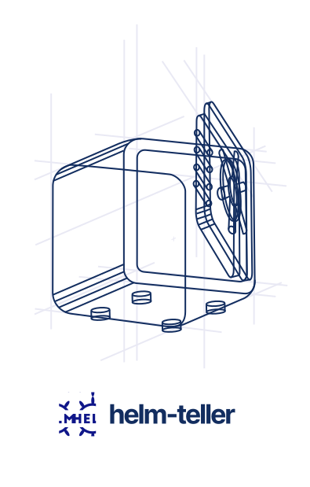
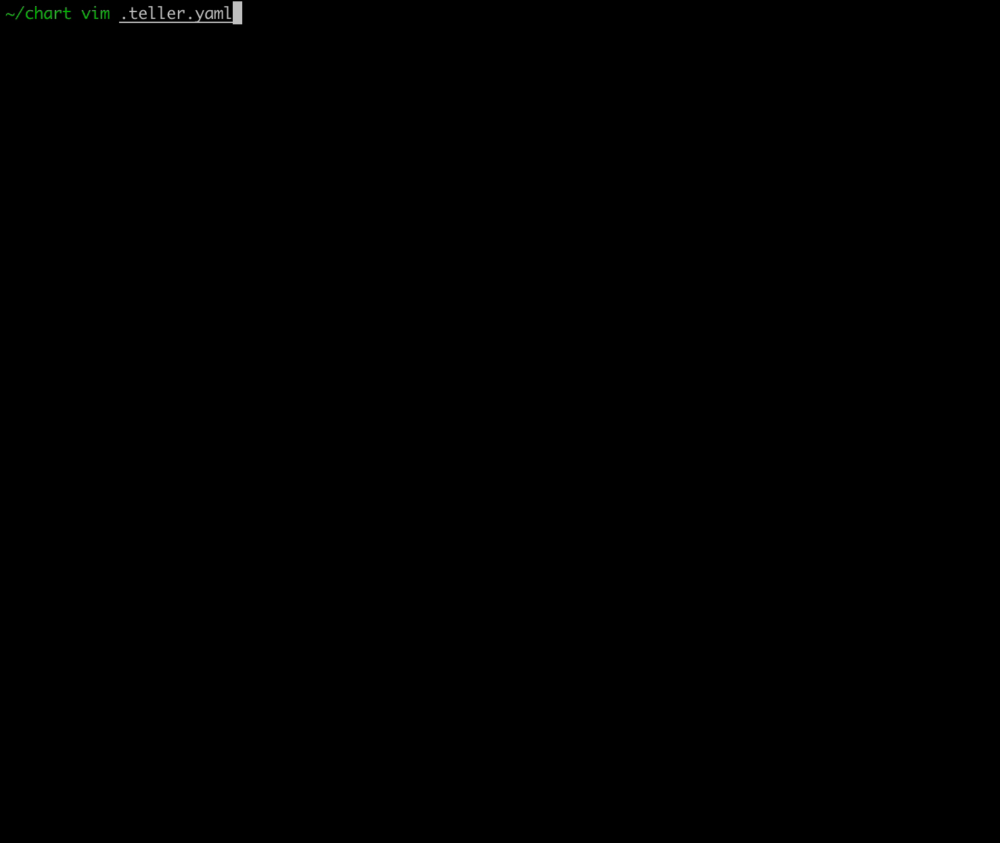

<p align="center">
<br/>
<br/>
<br/>
   
<br/>
<br/>
</p>

<p align="center">
<b>:computer: Never leave your terminal for secrets</b>
<br/>
<b>:pager: Same workflows for all your environments</b>
<br/><br/><br/>
<hr/>
</p>
<p align="center">


</p>

# Helm-teller

Helm [Teller](https://github.com/SpectralOps/teller) 
Allows you to inject configuration and secrets from multiple providers into your chart while masking the secrets at the deployment.


## Why should i use it?
* More secure while using `--debug` or `--dry-run` the secrets will not show in the STDOUT
* Simple to integrate
* Rich of supported plugins
* Pull configuration and secret from multiple providers in one place
* Manage configuration from development to production in the same way




## Installation
```sh
$ helm plugin install https://github.com/SpectralOps/helm-teller
```

## Quick Start with helm teller
* Create [.teller.yaml](https://github.com/SpectralOps/teller#quick-start-with-teller-or-tlr) file in your helm chart.
```yaml
providers:
  # vault provider
  vault:
    env_sync:
      path: redis/config
  # Consul provider
  consul:
    env:
      loglevel:
        path: log-level
 
```
* Set teller fields in your helm chart 
```yaml
apiVersion: v1
kind: ConfigMap
metadata:
  name: test-config-map
data:
  redis-host: {{ .Values.teller.host }}
  redis-password: {{ .Values.teller.password }}
  loglevel: {{ .Values.teller.loglevel }}
```
* Run helm teller deploy `helm teller [install/upgrade] {PLUGIN_FLAGS} -- {NATIVE_HELM_FLAGS}`.
 

See working example [here](./examples)


## Contributing

See the [contributing](./CONTRIBUTING.md) directory for more developer documentation
